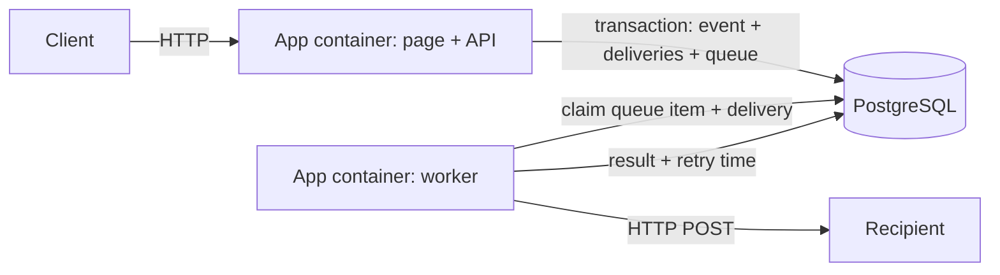

# DeliveryKit

DeliveryKit accepts events and delivers each one to registered webhook recipients. It runs as one container with an API, a simple browser page, and workers, plus PostgreSQL. The same image can also run as an API-only or worker-only container. A React interface can replace the current page later; the API already serves the page from the same origin and port.



PostgreSQL is the durable work queue. The API inserts the event, deliveries, and queue items in one transaction. Workers claim queue items and deliveries with conditional database updates, so multiple worker containers can share one database. Failed attempts stay in the queue and retry after exponential backoff, starting at 5 seconds and capped at one hour. A successful delivery completes its queue item. Delivery is **at least once**: a crash after a recipient accepts a POST but before success is recorded can produce a second POST. The `Idempotency-Key` header remains the delivery UUID across retries.

## Single-machine install

Requires Docker Compose. Copy the example environment file and set a strong database password and admin token:

```bash
cp env.example .env
docker compose up --build -d
docker compose logs -f app
```

Open `http://localhost:8080` (or the port set by `APP_PORT`). The app serves the current browser page and API on the same port. PostgreSQL stays on the private Compose network; its data is in the `pgdata` volume. No Nginx is required for this setup. Put a TLS reverse proxy in front of the app when exposing it on the internet. `docker compose down` stops the services; `docker compose down -v` also **deletes the database volume**.

The application reads these variables from `.env`:

| Variable | Purpose |
| --- | --- |
| `DATABASE_URL`, `DATABASE_USER`, `DATABASE_PASSWORD` | PostgreSQL connection. The URL in the example points to the Compose `db` service. |
| `DATABASE_NAME` | Database created by the Compose PostgreSQL container. Keep the database name in `DATABASE_URL` aligned with it. |
| `ADMIN_TOKEN` | Protects endpoint management and manual retry. |
| `APP_PORT` | Host port for the API and page. |
| `ALLOW_HTTP_TARGETS` | Permit HTTP webhook targets for local testing; leave `false` for public deployments. |
| `WORKER_ENABLED` | Run workers in the API container. `true` makes the smallest two-container install. |
| `WORKER_CONCURRENCY` | Concurrent webhook attempts per worker container, from 1 to 32. |
| `WORKER_POLL_INTERVAL_MS` | Delay between database polls. |

For dedicated workers, set `WORKER_ENABLED=false` in `.env` and start the optional worker service:

```bash
docker compose --profile workers up --build -d --scale worker=2
```

This runs one API container, two worker containers, and one database container on the same machine. Increase or decrease the worker count and concurrency based on webhook latency and database capacity. Each worker has no inbound port. The API and workers use the same image and environment variables; the worker service sets `SPRING_MAIN_WEB_APPLICATION_TYPE=none` to avoid starting an HTTP server. Avoid scaling the `db` service; all replicas need the same PostgreSQL database.

## Containers on AWS

Build and push the Dockerfile image to ECR. Run that image in two ECS services connected to one PostgreSQL database: an API service with an HTTP listener and `WORKER_ENABLED=false`, and a worker service with `WORKER_ENABLED=true` and `SPRING_MAIN_WEB_APPLICATION_TYPE=none`. Scale either service independently. For a low-volume deployment, one ECS service with `WORKER_ENABLED=true` can run both roles. ECS task environment variables correspond to the keys in `env.example`; inject the database password and admin token as secrets. The database may be RDS PostgreSQL or PostgreSQL you manage. ECR stores the image and ECS runs the containers; neither is needed for self-hosting.

This repository does not currently include an AWS infrastructure template or deployment automation. Provision an HTTPS entry point, database, and network access appropriate to your installation. The app responds at `/health` when its database is available. The image exposes port 8080.

## API and delivery behavior

`POST /webhooks` accepts `{"eventId":"unique-1","payload":{"kind":"demo"}}` and returns delivery IDs with status 202. Repeating an event ID with the same payload returns its existing deliveries; a different payload is rejected. Each endpoint gets its own delivery. `GET /deliveries/{id}` shows status, attempts, and last error. `POST /deliveries/{id}/retry` accepts a failed delivery and requires `X-Admin-Token`; endpoint creation and listing require the same token. The recipient receives `X-Webhook-Event-Id` and a stable `Idempotency-Key`.

Flyway owns the schema in `src/main/resources/db/migration`. Hibernate validates it at startup. The initial migration is unchanged, and V2 renames the queue table without dropping its data. If migrating a database originally created with `schema.sql` and no Flyway history, back it up, confirm it matches V1, and start once with `FLYWAY_BASELINE_ON_MIGRATE=true`; then remove that setting. Inspect `flyway_schema_history` before normal operation.

Run tests with `./mvnw test`, format Java sources with `./mvnw spotless:apply`, and check formatting with `./mvnw spotless:check`. The Maven `verify` phase also checks formatting. Build an image with `docker build -t deliverykit:local .`. Tests use H2 and a local HTTP server or mocked HTTP client; they need no AWS resources.

## Current limits

- The browser page is a simple static page, not React yet.
- Event submission and delivery lookup are unauthenticated. Use network controls or add authentication before serving untrusted users.
- HTTPS endpoint validation does not block private destinations after DNS resolution. Restrict egress or use an allowlist before accepting endpoint registrations from untrusted users.
- There is no retry limit, dead-letter queue, tenant isolation, signed webhook, or payload retention policy. Repeatedly failing deliveries remain in the database and retry at most once per hour.
